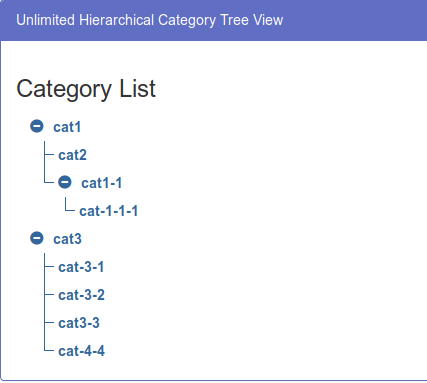

# Category Tree

Your goal is to create a category tree, with infinite depth.
You may pick a framework and libraries that you are comfortable with, but without using any library that is implementing trees for you. The result should be something like this:

Your solution should include next features:

- Ability to add new subcategories for each category.
- Rename category.
- Delete category (if it has children - delete them as well).
- Expand/Collapse parent category (children categories should collapse too).

As a bonus you can do any set of optional tasks, you’re free to add anything you can imagine. Some examples:

- Save (and Load) this tree in LocalStorage
- Testing
- Typings
- Styling
- Build & Deploy configurations
- Create Multiple trees

## Submission

- Create a project from scratch.
- The target of your bundle/project should be `build` folder in the root of the repo.
- Once you are ready please delete `node_modules` create ZIP archive and send it back in response to the initial email with a task. Please specify in the email how long the task took to complete.
